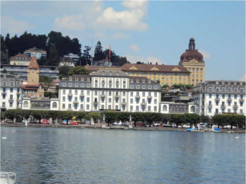
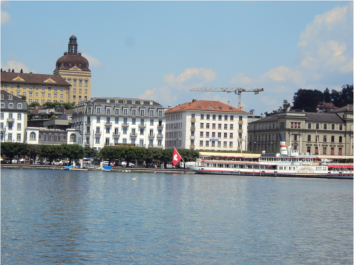
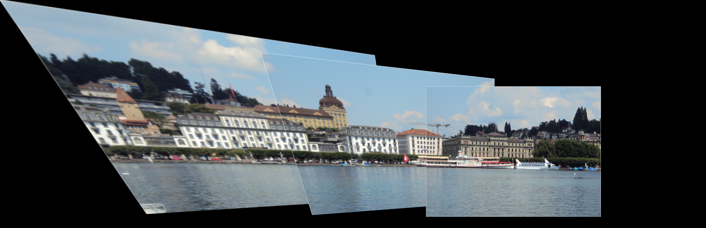

# Auto-Pano
Panorama Stitching using Classical Computer Vision

This repository implements classical approach for panorama image stitching. Classical Approach of image stitching uses corner detection, Adaptive non-maximal suppression, feature descriptor, matching and RANSAC.

  

The path to the folder of images can be provided as mentioned below.

``python Wrapper.py --Folder $PATH_TO_DATA
``